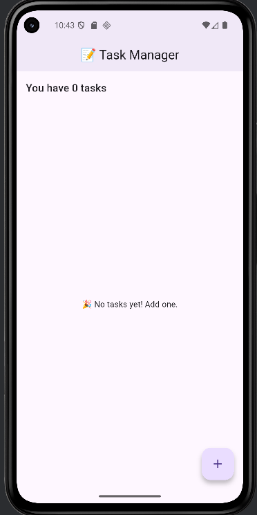
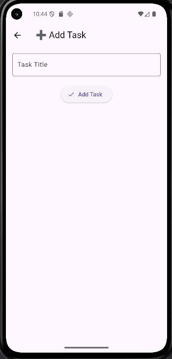
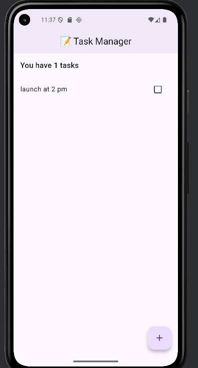
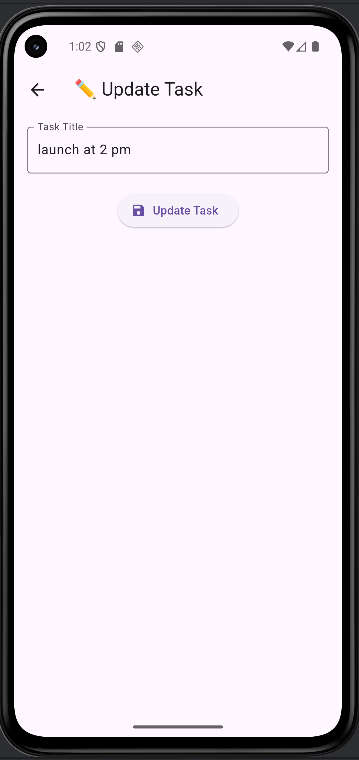

## 📝 Task Manager App – Week 6

## 🚀 State Management with Provider & Final Project Enhancements

This Flutter app is a Task Management App built during Week 6 of the course.
It demonstrates state management with Provider, task handling (add, update, delete, toggle), and UI/UX improvements with animations.

## 🎯 Learning Objectives

✔️ Apply state management using Provider.
✔️ Refactor app architecture for better performance.
✔️ Implement real-time UI updates.
✔️ Add animations & clean UI styling.

🛠️ Features

✨ Add new tasks with a title.
✨ Mark tasks as completed / pending (with strike-through).
✨ Swipe to delete tasks (Dismissible animation).
✨ Update task titles with live state management.
✨ Clean Material UI with icons & floating action button.
✨ Optimized with Provider best practices.

📂 Project Structure
lib/
┣ main.dart                # App entry point
┣ models/
┃   ┗ task.dart            # Task model
┣ providers/
┃   ┗ task_provider.dart   # State management logic
┣ screens/
┃   ┣ home_screen.dart     # Main screen
┃   ┗ add_task_screen.dart # Add task page
┣ widgets/
┃   ┣ task_list.dart       # Task list UI
┃   ┗ task_tile.dart       # Single task widget

📸 Screenshots (Sample)

✅ Home Screen with list of tasks.
✅ Add Task Screen with text input.
✅ Swipe-to-Delete Animation.

🏗️ Installation & Setup

Clone the repo:

git clone https://github.com/Bakhtawar-Alias-Rimsha/todolist_app.git

## Install dependencies:

flutter pub get
Run the app:
flutter run

👩‍💻 Author Bakhtawar Alias Rimsha
